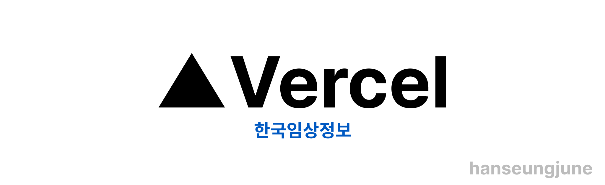

# Preonboarding Final Project

[](https://hanseungjune-pre-onboarding-11th-4-1.vercel.app/)

<br/>

## 📅 기간

- 2023년 7월 16일 ~ 2023년 07월 19일

## 💭 구현 목표

- 검색창 구현

- 검색어 추천 기능 구현

- 캐싱 기능 구현

- 아래 사이트의 검색영역을 클론하기

  [](https://clinicaltrialskorea.com/)

## ✅ Task

- 질환명 검색시 API 호출 통해서 검색어 추천 기능 구현

  - 검색어가 없을 시 "검색어 없음 표출"

    

- API 호출별로 로컬 캐싱 구현

  - 캐싱 기능을 제공하는 라이브러리 사용 금지(React-Query 등)

  - 캐싱을 어떻게 기술했는지에 대한 내용 README에 기술

  - `expire time`을 구현할 경우 가산점

    ```ts
    // 추상화 작업

    // 기본 URL을 설정
    // Axios 인스턴스를 생성
    // Map 객체로 cacheKey와 데이터{data, timestamp}를 저장할 객체 생성
    // ExpireTime : 60 minutes
    // path와 config(ex. headers)을 JSON 문자열로 변환하여 캐시Key 생성
    // cacheKey는 url이며, 해당 url 요청에 따른 데이터가 있다면,
    // 만료 되기 전에 해당 요청 데이터를 응답
    // return을 거치지 않는다면, 만료된 캐시는 삭제
    // 캐시된 응답이 없거나 만료된 경우, 실제 HTTP 요청 및 반환
    // 새로운 응답을 캐시에 저장(timestamp: 요청 시간)
    ```

    사실 위에 작성된 주석처럼 로컬 캐싱 기능을 살리는 과정을 어려웠다.
    여러 블로그를 찾아서 했음에도 제각기 방식이 달랐고, 사실 이해하기 어려운 코드가 많았다
    그래서 위의 추상화 작업과 비슷한 코드를 찾아서 작성해보았고, 이는 성공했다.
    ex. 처음 말라리아를 검색할 때 나오는 속도와 이후에 검색할 때 나오는 속도는 확실히 달랐다.

    ```ts
    import axios, { AxiosRequestConfig, AxiosResponse } from "axios";

    class HttpClient {
      private BASE_URL = `http://localhost:4000/sick`;

      // axios 요청 객체 생성
      protected axiosInstance = axios.create({
        baseURL: this.BASE_URL,
      });

      // 캐시 저장 객체 생성(Map)
      private cache = new Map<string, { data: any; timestamp: number }>();
      // 1시간(임의설정)
      private cacheExpireTime = 60 * 60 * 1000;

      async get(
        path: string,
        config?: AxiosRequestConfig
      ): Promise<AxiosResponse<any>> {
        // 요청 데이터 키
        const cacheKey = JSON.stringify({ path, config });
        // 요청 데이터
        const cachedResponse = this.cache.get(cacheKey);

        if (cachedResponse) {
          // 만료되기 전
          if (Date.now() - cachedResponse.timestamp < this.cacheExpireTime) {
            return cachedResponse.data;
          }
          // 만료됨
          this.cache.delete(cacheKey);
        }

        // 캐시된 데이터 없을 때
        const response = await this.axiosInstance.get(path, config);
        // 검색 데이터 캐싱
        this.cache.set(cacheKey, { data: response, timestamp: Date.now() });
        return response;
      }
    }

    // eslint-disable-next-line import/no-anonymous-default-export
    export default new HttpClient();
    ```

    간단하게 주석을 달아서 코드를 해석했다. 물론 수업에서는 주석없이 이해가 되는 코드가 좋은 코드라고 했지만, 그게 아직 나의 레벨에서는 쉽지않다고 느꼈다. 캐싱 작업이 적용 되는 화면을 보면 미세하게 빨라짐이 보일 것이다.

    

- 입력마다 API 호출하지 않도록 API 호출 횟수를 줄이는 전략 수립 및 실행
  - README에 전략에 대한 설명 기술
- API를 호출할 때 마다 `console.info("calling api")` 출력을 통해 콘솔창에서 API 호출 횟수 확인이 가능하도록 설정

  ```js
  // 말라리아 입력 시 호출 횟수:  12회
  useEffect(() => {
    const fetchData = async () => {
      const response = await httpClient.get(`?q=${typing}`);
      dispatch(setShowing(response.data));
      console.info("calling api");
    };
    fetchData();
  }, [dispatch, typing]);
  ```

  일반적으로 입력할 때마다 요청했을 때, 12번의 키보드 타이핑에 맞춰서
  12번 요청이 되버린다.

  ```js
  // 말라리아 입력 시 호출 횟수: 1회
  useEffect(() => {
    if (timeoutId) {
      clearTimeout(timeoutId);
    }

    if (typing !== "") {
      // eslint-disable-next-line react-hooks/exhaustive-deps
      timeoutId = setTimeout(async () => {
        const response = await httpClient.get(`?q=${typing}`);
        dispatch(setShowing(response.data));
        console.info("calling api");
      }, 300);
    }

    return () => {
      if (timeoutId) {
        clearTimeout(timeoutId);
      }
    };
  }, [dispatch, typing]);
  ```

  하지만, debouncing을 통해서 요청에 대한 약간의 딜레이를 준다면 HTTP 요청의 횟수를 줄일 수 있게 된다.
  물론 키보드를 연속적으로 타이핑 할 때 요청 횟수가 줄어들고, 천천히 타이핑을 하게 된다면 똑같이 12회 요청되는 것은 같다. 하지만 UX 측면을 고려할 때는 debouncing이 굉장히 좋지 않나 하는 생각이 든다.
  화면은 다음과 같다.

    

- 키보드만으로 추천 검색어들로 이동 가능하도록 구현
  - 사용법 README에 기술

    ```tsx
    // SearchFrom.tsx
    const KeyboardMove = (e: React.KeyboardEvent<HTMLInputElement>) => {
      if (e.key === "ArrowUp") {
        dispatch(setActiveSearchIndex(Math.max(activeSearchIndex - 1, -1)));
      } else if (e.key === "ArrowDown") {
        dispatch(
          setActiveSearchIndex(
            Math.min(activeSearchIndex + 1, showing.length - 1)
          )
        );
      } else if (e.key === "Enter" && activeSearchIndex > -1) {
        dispatch(setTyping(showing[activeSearchIndex].sickNm));
        dispatch(setActiveSearchIndex(-1));
      }
    };
    ```

    해당 함수는 키보드를 통해서 포커스를 잡을 인덱스를 기억하는 함수이다.

    시작이 -1이기 때문에 input 태그에서 ArrowDown 키를 누르면 0이 되면서 포커싱이 시작된다.

    그리고 인덱스가 보여주는 리스트의 길이보다 넘어가게 될 수 있기 때문에 인덱스 파티셔닝을 통해서
    함수가 실행 될 수 있게 하였고, 원하는 인덱스의 요소를 선택하고 싶을 때는 엔터를 누르면서 setTyping이라는 액션을 실행하여 추천 검색어 API를 요청한다. 
    
    API를 요청하고 인덱스는 다시 -1로 바꿔줌으로써 인덱싱을 초기화한다.

    ```tsx
    // SearchResultList.tsx
    <SearchedListContainerStyle>
      <span>추천 검색어</span>
      {/* 추천 검색어 리스트 */}
      {showing.length > 0 && typing.trim() !== "" ? (
        showing.map((item: setShowingType, index: number) => {
          return <SearchResult key={index} isActive={activeSearchIndex===index} title={item.sickNm} />;
        })
      ) : (
        <SearchResult
          title={"검색어 없음"}
        />
      )}
    </SearchedListContainerStyle>
    ```
    해당 코드에서는 isActive라는 props를 넘겨줌으로써 어떤 요소에 포커싱이 기억되는지 체크하기 위해서 isActive가 true를 뱉어내면, 배경색을 바꿔줌으로써 기억하게 된다.

    ```tsx
    const SearchedListStyle = styled.div<SearchedListStyleProps>`
      ${({ theme, isActive }) => {
        const { buttonTextColor } = theme;
        return `
        display: flex;
        align-items: center;
        margin: 10px 10px;
        background-color: ${buttonTextColor};

        & > span {
          margin-left: 10px;
          background-color: ${isActive ? "yellow !important" : "white !important"};
        }
        `;
      }}
    `;

    interface SearchResultPropsType {
      title: string;
      isActive?: boolean;
    }

    const SearchResult = ({ title, isActive }: SearchResultPropsType) => {
      return (
        <>
          <SearchedListStyle isActive={isActive}>
            <SearchIconStyle />
            <span>{title}</span>
          </SearchedListStyle>
        </>
      );
    };
    ```

    인덱스를 포커싱 함에 따라서 글의 배경색이 바뀌게하는 코드이다.

    - 추가로 Enter를 눌렀을 때, form 태그의 onSubmit 이벤트가 자동으로 중첩되서 실행이 됩니다.
    그래서 e.preventDefault()를 통해서 이벤트를 중지하게 했다.

    

## 🎤 기능 구현 상황

- ⭕ 화면 전체 스켈레톤 코드 작성 완료
- ⭕ 화면 전체 레이아웃 및 페인팅 코드 작성 완료
- ⭕ 검색 및 추천 검색어 요청 기능 구현 완료
- ⭕ HttpClient Class를 활용한 axios API 연동 완료
- ⭕ Redux를 통한 전역 상태 관리 완료
- ⭕ API 호출 횟수 감소를 위한 디바운싱 완료
- ⭕ class를 활용하여 API 호출 별로 로컬 캐싱 구현 완료
- ⭕ 키보드만으로 추천 검색어들로 이동 가능하도록 구현 완료

<br/>

## 🛠️ Stacks


  
  

<br/>

## 🌳 File Tree

```
📦src
 ┣ 📂components
 ┃ ┣ 📜SearchForm.tsx
 ┃ ┣ 📜SearchHeader.tsx
 ┃ ┣ 📜SearchResult.tsx
 ┃ ┗ 📜SearchResultList.tsx
 ┣ 📂fonts
 ┃ ┣ 📜LINESeedKR-Bd.ttf
 ┃ ┣ 📜LINESeedKR-Rg.ttf
 ┃ ┗ 📜LINESeedKR-Th.ttf
 ┣ 📂hooks
 ┃ ┗ 📜hooks.ts
 ┣ 📂interface
 ┃ ┗ 📜interface.ts
 ┣ 📂store
 ┃ ┣ 📜index.ts
 ┃ ┣ 📜result.ts
 ┃ ┗ 📜search.ts
 ┣ 📂styles
 ┃ ┗ 📜styles.ts
 ┣ 📜App.tsx
 ┣ 📜GlobalStyle.ts
 ┣ 📜httpClient.ts
 ┣ 📜index.tsx
 ┗ 📜react-app-env.d.ts
```

## ✒️ 회고

<table>
  <thead>
    <tr>
      <th width="45%">좋았던 점</th>
      <th width="45%">아쉬웠던 점</th>
    </tr>
  </thead>
  <tbody>
    <tr>
      <td>
        <li>사실 클래스를 통해서 httpClient Class를 만들어 본 것이 처음이었다. 그래서 안해본 것을 하다보니 어려움이 있었지만, API 요청에 대한 캐싱 작업등을 해보면서 class에 대한 위화감이 사라지고, 꼭 필요하구나 하는 느낌을 받았다. 많이 배웠다.</li>
        <li>그리고 이전에 프로젝트 할 때는 입력할 때마다 HTTP 요청을 했었고, 요청 횟수를 줄이는 것에 대한 생각을 해본 적이 없었다. 하지만 서버의 부하 감소라던지, 네트워크 지연 시간 감소 등의 이유를 알게 되었고 이 또한 배웠다고 생각한다.
        </li>
        <li>키보드를 통해서 추천 검색어를 선택하는 것에 대한 생각도 역시 해본적이 없는데, 이것도 사용자 경험을 위해서는 꼭 필요한 작업이라고 생각했다. 물론 사실 여기서 제일 구현하기 힘든 기능이었다. 그럼에도 열심히 구글링하면서 찾아보았고, 여러가지 시행 착오를 겪으면서 기능을 구현하여 뿌듯해서 좋았다.
        </li>
        <li>CustomHook을 만들어서 사용해봄으로써, 커스텀 훅의 재사용성에 대해서 많이 배웠다고 생각한다. 앞으로도 특별한 기능이 아니고 일반적인 기능을 구현할 때, custom Hook을 사용하는 것을 항상 고려하는 습관을 지녀야겠다.
        </li>
      </td>
      <td>
      <li>아쉬웠던 점은 이전 팀 프로젝트를 몸이 좀 안좋았어서 참여를 못했고, 그로 인해서 배워가지 못한 부분이 있을 것이라고 생각했는데, 그래서 이번에 최종 프로젝트를 하면서 어려움을 겪었다고 생각한다. 그래서 좀 이번 프로젝트를 하면서 아쉬움을 느꼈다.
      </li>
      <li>컴포넌트를 나누기 전에 키보드 이동 기능부터 구현했었다면, 조금 더 편하게 코드를 작성할 수 있지 않을까하는 생각이 들었다. 그게 아쉬웠다.
      </li>
      </td>
    </tr>
  </tbody>
</table>
